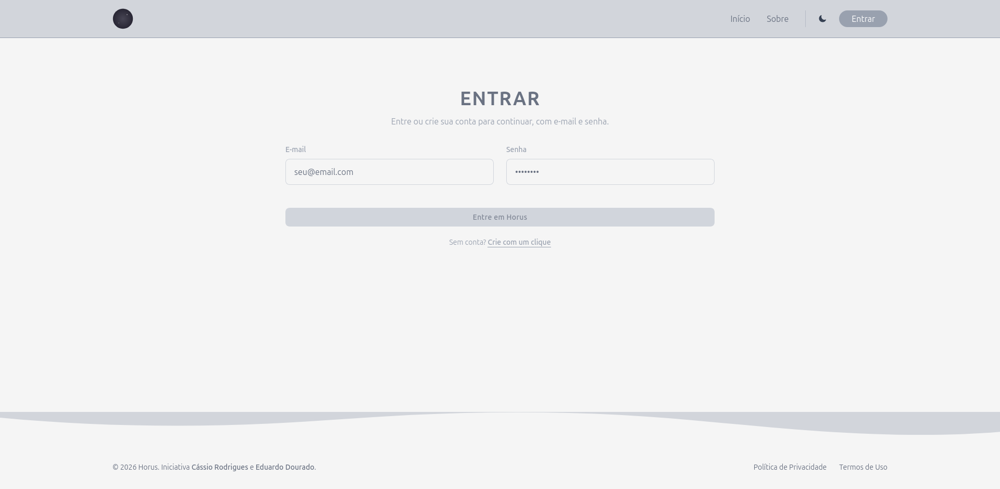

# Sobre o projeto

Estudo e aprimoramento técnico de arquitetura, segurança, concorrência e engenharia de software full-stack.

---

## Run

### 1. Instalação
Na raiz do projeto, instale as dependências simultaneamente (front e back):
```bash
npm run install:all
```

### 2. Banco de Dados
Na pasta do backend, crie seu arquivo `.env` e rode as migrações do Prisma para gerar o banco local:
```bash
cd backend && npx prisma migrate dev --name init
```

### 3. Iniciando Servidores
Com um único comando:
```bash
npm run dev
```

---

## Endpoints

* /


* login/



* register/


* about/

* privacy/
* terms/

---

## Roadmap

### Segurança
- [x] Configuração Inicial;
- [o] Integração frontend-backend para autenticação completa.

### Core (Wallet)
- [o] Modelagem do banco de dados para carteiras e transações.

### Jogos
- [o] Criação do primeiro jogo base (e.g. Roleta).